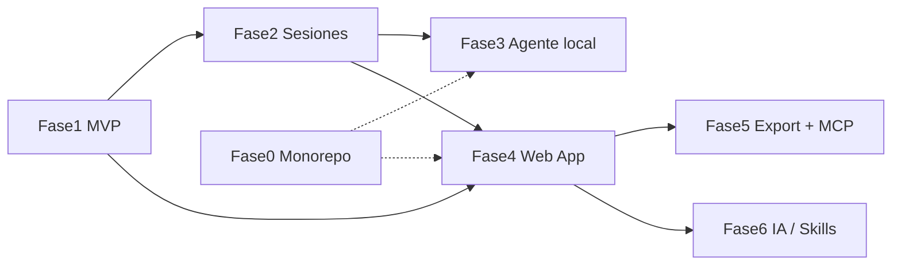

# WorkingDocs - Plan de Implementación por Fases

Producto greenfield. La Fase 1 (núcleo PR -> Markdown) ya está implementada y verificada (ver [docs/tareas-realizadas/2026-08-27-fase1-mvp-scaffold.md](docs/tareas-realizadas/2026-08-27-fase1-mvp-scaffold.md)). Este plan cubre cerrar la Fase 1 y avanzar por las fases siguientes. Los PRDs en `docs/` son partes distintas del mismo producto, no productos separados.

## Mapeo PRD -> Fase

- `PRD Agente MVP` + `MVP Microservicio REST` -> Fase 1 (hecha parcialmente)
- `Sesión de Documentación Activa` -> Fase 2
- `PRD Docs Agent (agente local)` -> Fase 3
- `PRD Web App` + `PRD v2` -> Fase 4
- `PRD v2` (export) + `Integración MCP` -> Fase 5
- `Taxonomía de Skills` + `Referencia claude-blog` + `Caso de Uso Auditoría` -> Fase 6
- `Stack Tecnológico y Arquitectura Monorepo` -> Fase 0 (transversal)

## Orden y dependencias

## Fase 1 - Cerrar el MVP (PR -> Markdown)

Núcleo implementado en `src/` (Fastify + Octokit + provider OpenAI-compatible). Falta:

- Prueba end-to-end real: configurar `.env` con `GITHUB_TOKEN` y credenciales de Opencode (`LLM_BASE_URL`, `LLM_API_KEY`, `LLM_MODEL`), correr contra un PR real y afinar el prompt en [src/llm/prompt.ts](src/llm/prompt.ts).
- Hardening: reintentos con backoff en [src/llm/openai-provider.ts](src/llm/openai-provider.ts), timeouts en GitHub/LLM, endpoint `GET /v1/documents/:id/content` en [src/routes/documents.ts](src/routes/documents.ts).
- CI (GitHub Actions): install -> typecheck -> test -> build.

## Fase 0 - Fundaciones y monorepo (transversal)

- Decidir migración a monorepo `pnpm + Turborepo` (recomendado antes de Fase 3/4).
- Estructura `apps/{api,cli,web}` + `packages/{github,llm,markdown,core,config}`; mover `src/` actual a `apps/api` y extraer paquetes.
- Tooling: ESLint + Prettier, convención de commits, plantilla de PR.

## Fase 2 - Sesión de Documentación Activa

- Modelo `Session` + eventos; persistencia en `data/sessions/{id}.json` y `data/events/{id}.jsonl`.
- Job de captura por polling (commits + PRs de una rama), dedupe por SHA/PR, no bloqueante.
- Ciclo de vida: TTL (default 24h), finish y cancel manuales.
- Consolidación al finalizar -> Markdown en `data/docs/sessions/{id}-{branch}.md`.
- Rutas `POST /v1/sessions`, `GET /v1/sessions/:id`, `.../finish`, `.../cancel`, `.../events`.

## Fase 3 - Docs Agent local (CLI en el workspace)

- CLI (`apps/cli`, Commander.js): `start/finish/status/config`.
- Watcher de archivos (chokidar) + git local; agrupación por sesión; exclusiones/privacidad.
- Generación de borradores y sincronización con backend (`POST /v1/drafts`) + cola de reintentos offline.

## Fase 4 - Web App (fuente de verdad)

- Persistencia real: PostgreSQL (workspaces, usuarios, documentos, versiones) + almacenamiento de contenido; migraciones (Drizzle/Prisma). Migrar el store de archivos actual.
- Backend: auth + permisos por workspace, CRUD + búsqueda full-text, versionado, tags, compartir por enlace.
- Frontend (`apps/web`, Next.js + React): login, dashboard, editor con autosave, vista de trazabilidad, búsqueda/filtros, historial, responsive.
- Ingesta de borradores (Fase 3) y docs (Fases 1-2).

## Fase 5 - Exportaciones + MCP

- Arquitectura de conectores (interfaz de "destino de publicación").
- Export a Jira y publicación en Confluence con estado de sincronización (posible reuso del MCP de Atlassian del entorno).
- Servidor MCP de WorkingDocs: `search_docs`, `get_workflow`, `diff_docs`, `propose_update`, `publish_update`; lógica de decisión en el servidor (no en el modelo), permisos y auditoría.

## Fase 6 - Motor de skills, gates de calidad e IA de auditoría

- Flujo por etapas `find -> inspect -> synthesize -> verify -> publish`.
- Skills de responsabilidad única: `repo-scan`, `change-cluster`, `work-summary`, `evidence-check`, `confidence-score`, `missing-docs`, `duplicate-work-detector`, `manager-view`.
- Gate bloqueante (`audit-reviewer`): bloquear resúmenes pobres o sin evidencia; revisión humana si la confianza es baja.
- Evaluar LlamaIndex como motor de retrieval/agente; detección de docs desactualizados.

## Componentes transversales

- Trazabilidad obligatoria en todo doc (links a commits/PRs). Nunca inventar contexto.
- API keys solo en backend/entorno.
- Testing con Vitest + CI desde Fase 2. Logs estructurados (Fastify).
- Guardrails de IA: no documentar cambios triviales; no publicar sin revisión con confianza baja.

## Hitos

- M1 Generación validada (Fase 1 completa)
- M2 Captura continua (Fase 2)
- M3 Captura desde el flujo (Fase 0 + 3)
- M4 Plataforma usable (Fase 4)
- M5 Distribución (Fase 5)
- M6 Inteligencia (Fase 6)

El plan detallado con tareas y subtareas ya está en [planning/plan-implementacion.md](planning/plan-implementacion.md).