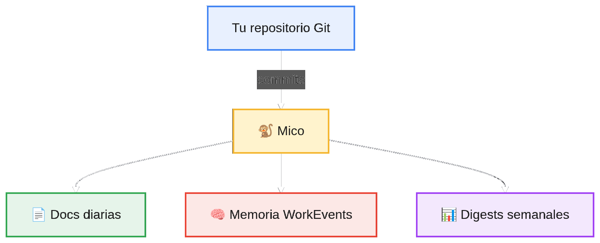

<div align="center">


# Mico 🐒

### Your project evolves. Mico watches and remembers.

**Mico observes your development activity, analyzes changes with AI, and turns Git evidence into documentation, memory, and retrievable context.**

[](https://nodejs.org/)
[](https://www.typescriptlang.org/)
[](LICENSE)

*Read this in [Español](README.md)*

</div>

---

## 💡 What is Mico?

Mico is an autonomous developer agent written in **Node.js + TypeScript** that monitors Git activity and builds a **structured memory of what actually happens in your project**.

Instead of relying on someone to manually write documentation for every milestone, Mico gathers available evidence —commits, commit messages, modified files, and diffs— and uses an LLM to turn them into structured, actionable information.

<div align="center">



</div>

### In a nutshell

> **Git stores what changed. Mico preserves what it means.**

---

## 🚀 Quick Start (Under 2 Minutes)

Mico is designed to run directly on any existing repository without friction.

### 1. Initialize Mico with the interactive setup

From your project root:

```bash
npx mico-agent init
```

The CLI wizard will guide you through:
- Selecting your AI provider: **OpenAI**, **Groq**, **Ollama/Local**, or **Custom**;
- Setting your API key (or auto-detecting existing environment variables);
- Choosing the target repository path and output folder (`./docs/mico` by default);
- Optionally installing the automated **Git Hook**;
- Optionally launching the background daemon right away.

To use default options without interactive prompts:

```bash
npx mico-agent init --yes
```

You can also re-run the wizard anytime with:

```bash
npx mico-agent config
```

### 2. Choose how you want Mico to monitor commits

Pick one of the three available modes:

#### 🪝 Git Hook (Recommended for local development)

Zero resident RAM consumption. A `post-commit` hook automatically triggers Mico in the background right after each commit:

```bash
npx mico-agent hook install
```

To uninstall:

```bash
npx mico-agent hook uninstall
```

#### 🔄 Background Daemon

Mico runs continuously in a detached background process, monitoring your repo periodically without holding up your terminal:

```bash
npx mico-agent daemon start
```

Check status and logs, or stop it anytime:

```bash
npx mico-agent daemon status
npx mico-agent daemon stop
```

#### 🖥️ Foreground Mode

Best for local testing and live debugging:

```bash
npx mico-agent start
```

---

## ✨ What Does Mico Do?

### 🐒 Observes your activity
Monitors your local repository using configurable polling intervals and tracks new commits without disrupting your normal workflow.

### 🤖 Understands the changes
Mico doesn't just copy commit messages. It sends commit metadata, touched files, and diffs to an LLM to interpret context and business impact. Compatible with any OpenAI-compatible provider:
**OpenAI · Groq · Ollama · OpenRouter · LM Studio · and more.**

### 📅 Builds daily Markdown documentation
Mico creates or appends to daily reports:

```text
docs/mico/YYYY-MM-DD.md
```

Each entry includes executive summaries, commits analyzed, files modified, architectural impact, and source evidence.

### 🧠 Keeps a structured WorkEvent memory
Every processed commit is saved locally as a `WorkEvent` containing repository, commit hash, timestamp, claims, evidence, confidence scores, and review flags.

### 📊 Generates weekly digests
Aggregates past `WorkEvents` to synthesize weekly progress, technical decisions, detected drift, and pending tasks.

---

## 🚦 AI Interprets; Confidence Gate Governs

Mico implements a **Confidence Gate** using deterministic heuristics to ensure weak interpretations are not presented as facts.

If a commit's confidence score drops below `reviewThreshold`, Mico flags it:

```json
{
  "needsHumanReview": true
}
```

```text
Evidence → AI Interpretation → Confidence Gate → Documentation
```

---

## 🧰 CLI Reference

Run Mico directly via `npx` or install globally:

```bash
npm install -g mico-agent
```

| Command | Description |
|---|---|
| `npx mico-agent init` | Launch the interactive configuration wizard. |
| `npx mico-agent init --yes` | Initialize with default settings (non-interactive). |
| `npx mico-agent config` | Alias for `init` wizard. |
| `npx mico-agent hook install` | Install the `post-commit` Git hook. |
| `npx mico-agent hook uninstall` | Remove the Mico Git hook. |
| `npx mico-agent daemon start` | Start the daemon in the background. |
| `npx mico-agent daemon status` | Show daemon status and latest log lines. |
| `npx mico-agent daemon stop` | Stop the background daemon. |
| `npx mico-agent run-once` | Run a single pass over pending commits and exit. |
| `npx mico-agent start` | Run Mico in foreground mode. |
| `npx mico-agent document owner/repo 123` | Generate documentation for a specific GitHub PR. |
| `npx mico-agent digest --repo owner/repo` | Generate a weekly digest from local memory. |
| `npx mico-agent --version` | Display installed version. |
| `npx mico-agent --help` | Show command line help. |

---

## ⚙️ Configuration

Mico loads configuration following this precedence:
`Environment variables` → `mico.config.json` → `Defaults`

| Config Key | Environment Variable | Default |
|---|---|---|
| `llm.apiKey` | `LLM_API_KEY` | **Required** |
| `llm.baseUrl` | `LLM_BASE_URL` | `https://api.openai.com/v1` |
| `llm.model` | `LLM_MODEL` | `gpt-4o-mini` |
| `githubToken` | `GITHUB_TOKEN` | `""` |
| `mico.watchIntervalMs` | `MICO_WATCH_INTERVAL_MS` | `10000` |
| `mico.targetRepoPath` | `MICO_TARGET_REPO_PATH` | `./` |
| `mico.outputDir` | `MICO_OUTPUT_DIR` | `./docs/mico` |
| `mico.stateFile` | `MICO_STATE_FILE` | `./data/mico-state.json` |
| `documentsPath` | `DOCUMENTS_PATH` | `./data/docs` |
| `workEventsPath` | `WORK_EVENTS_PATH` | `./data/work-events` |
| `confidence.*` | `CONFIDENCE_*` | see calibration |

---

## 🧪 Local Development

```bash
git clone https://github.com/jmartinez-rs/mico.git
cd mico
npm install

npm run dev          # Watch mode
npm test             # Run test suite (Vitest)
npm run test:integration # Run integration suite
npm run build        # Build TypeScript dist
npm run calibrate    # Test against confidence golden set
```

---

## 📄 License

Distributed under the [MIT License](LICENSE).
