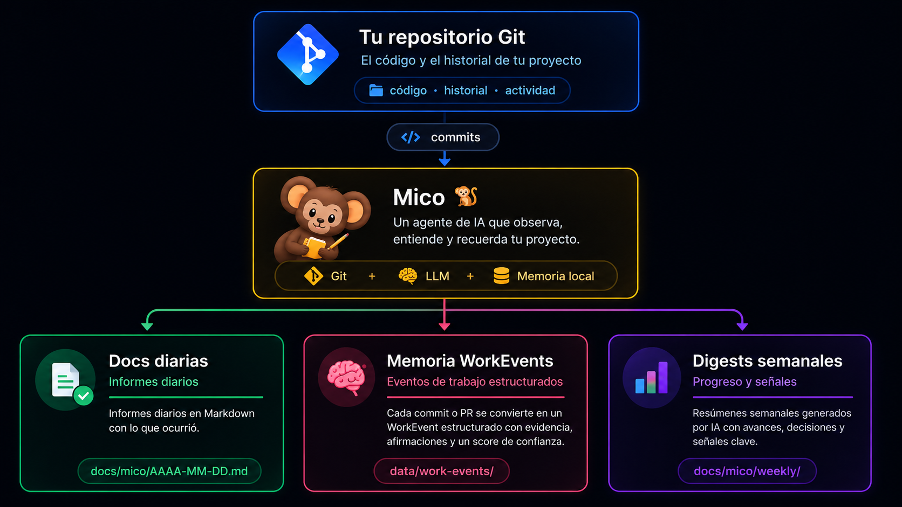

<div align="center">


# Mico 🐒

### Tu proyecto cambia. Mico lo observa y lo recuerda.

**Mico observa tu actividad de desarrollo, analiza los cambios con IA y convierte la evidencia de Git en documentación, memoria y contexto recuperable.**

[](https://nodejs.org/)
[](https://www.typescriptlang.org/)
[](https://fastify.dev/)
[](LICENSE)

*Leer en [English](README.en.md)*

</div>

---

## 💡 ¿Qué es Mico?

Mico es un agente autónomo de desarrollo escrito en **Node.js + TypeScript** que observa la actividad de un repositorio Git y construye una **memoria estructurada de lo que ocurre en el proyecto**.

En lugar de depender de que alguien documente manualmente cada avance, Mico toma la evidencia disponible —commits, mensajes, archivos y diffs— y utiliza un LLM para transformarla en información útil.

<div align="center">



</div>

---

## 🚀 Empezá en menos de 2 minutos

Mico está pensado para probarlo directamente sobre un repositorio existente.

### 1. Inicializá Mico

Desde la raíz de tu proyecto:

```bash
npx mico-agent init
```

El asistente interactivo te guía para:

- elegir tu proveedor de IA: **OpenAI, Groq, Ollama/Local o personalizado**;
- ingresar tu API key o detectar variables de entorno existentes;
- configurar el repositorio que querés monitorear;
- elegir dónde guardar los informes;
- activar opcionalmente el Git Hook;
- iniciar opcionalmente el daemon en segundo plano.

Para usar los valores por defecto sin interacción:

```bash
npx mico-agent init --yes
```

También podés abrir el asistente con:

```bash
npx mico-agent config
```

### 2. Elegí cómo querés que Mico observe los commits

Hay tres modalidades:

#### 🪝 Git Hook — recomendado para uso diario

No necesitás mantener ningún proceso residente. Un `post-commit` dispara el procesamiento automáticamente cada vez que hacés un commit.

```bash
npx mico-agent hook install
```

Para quitarlo:

```bash
npx mico-agent hook uninstall
```

#### 🔄 Daemon en segundo plano

Mico queda ejecutándose de forma continua y monitorea el repositorio sin ocupar tu terminal.

```bash
npx mico-agent daemon start
```

Podés consultar su estado y detenerlo cuando quieras:

```bash
npx mico-agent daemon status
npx mico-agent daemon stop
```

#### 🖥️ Primer plano

Ideal para desarrollo, debugging y logs en vivo:

```bash
npx mico-agent start
```

---

## ✨ ¿Qué hace Mico?

### 🐒 Observa tu actividad

Mico puede monitorear el repositorio mediante polling configurable y detectar nuevos commits sin modificar tu flujo de trabajo.

### 🤖 Entiende los cambios

Mico no se limita a repetir el mensaje del commit. Utiliza un LLM para interpretar la evidencia disponible y generar un resumen contextual.

Es compatible con proveedores que ofrecen una API compatible con OpenAI, incluyendo:

**OpenAI · Groq · Ollama · OpenRouter · LM Studio · otros compatibles**

### 📅 Construye documentación diaria

Mico genera o actualiza informes como:

```text
docs/mico/YYYY-MM-DD.md
```

Un informe puede incluir:

- resumen del día;
- commits detectados;
- cambios realizados;
- impacto;
- evidencia asociada.

### 🧠 Mantiene memoria del trabajo

Cada commit procesado se persiste como un `WorkEvent`.

Los eventos pueden conservar información como:

```text
repository
commit / PR
timestamp
evidence
claims
confidence
needsHumanReview
```

Así podés recuperar posteriormente **qué se hizo, cuándo ocurrió y con qué nivel de confianza fue interpretado**.

### 📊 Genera digests semanales

La memoria de eventos puede agregarse en un resumen semanal con:

- avances;
- decisiones;
- pendientes;
- señales de drift;
- actividad relevante.

El objetivo no es crear otro changelog.

Es construir una **memoria de desarrollo basada en evidencia**.

---

## 🚦 La IA interpreta; el Confidence Gate controla

Mico incorpora un **Confidence Gate** para evitar que una interpretación débil se presente como un hecho confiable.

El score de confianza se calcula mediante heurísticas deterministas que consideran, entre otras cosas:

- calidad de la descripción;
- calidad de los mensajes de commit;
- presencia de archivos;
- información disponible en los diffs.

Cuando el resultado queda por debajo de `reviewThreshold`, Mico lo marca para revisión humana:

```json
{
  "needsHumanReview": true
}
```

Esto mantiene una separación importante:

```text
Evidencia → interpretación con IA → evaluación de confianza → documentación
```

La IA aporta contexto. El gate introduce una capa determinista de control.

---

# 🪝 Automatización con Git Hook y Daemon

## Opción A — Git Hook `post-commit`

Instalá el hook:

```bash
npx mico-agent hook install
```

Después, cada `git commit` dispara `mico run-once` en segundo plano, sin mantener un proceso residente de Mico.

```bash
npx mico-agent hook uninstall
```

> El hook requiere que `mico` esté disponible mediante `npx` en el entorno donde se ejecuta el commit.

## Opción B — Daemon en segundo plano

```bash
npx mico-agent daemon start
npx mico-agent daemon status
npx mico-agent daemon stop
```

El daemon guarda su PID y logs en `data/`.

## Pasada única

Para procesar los commits pendientes una sola vez —por ejemplo, desde un cron, CI o el hook—:

```bash
npx mico-agent run-once
```

---

# 🧰 Comandos CLI

Podés usar Mico sin clonar este repositorio:

```bash
npx mico-agent <comando>
```

O instalarlo globalmente:

```bash
npm install -g mico-agent
mico <comando>
```

| Comando | Descripción |
|---|---|
| `npx mico-agent init` | Inicia el asistente interactivo de configuración. |
| `npx mico-agent init --yes` | Inicializa usando los valores por defecto. |
| `npx mico-agent config` | Alias del asistente de configuración. |
| `npx mico-agent hook install` | Instala el Git Hook `post-commit`. |
| `npx mico-agent hook uninstall` | Desinstala el Git Hook. |
| `npx mico-agent daemon start` | Inicia el daemon en segundo plano. |
| `npx mico-agent daemon status` | Muestra estado y últimas líneas del log. |
| `npx mico-agent daemon stop` | Detiene el daemon. |
| `npx mico-agent run-once` | Procesa una única pasada de commits pendientes. |
| `npx mico-agent start` | Inicia Mico en primer plano. |
| `npx mico-agent document owner/repo 123` | Genera documentación desde un PR de GitHub. |
| `npx mico-agent digest --repo owner/repo` | Genera el digest semanal desde la memoria local. |
| `npx mico-agent --version` | Muestra la versión instalada. |
| `npx mico-agent --help` | Muestra la ayuda de comandos. |

---

# 📄 ¿Cómo se ve la documentación?

Un informe generado por Mico puede verse así:

```markdown
# Informe de Desarrollo - 2026-08-31 🐒

> Documento generado por **Mico**, el agente observador de desarrollo.

## 📌 Visión General del Día

Este informe documenta las tareas y cambios realizados durante el día
2026-08-31.

## 📜 Registro de Commits e Implementaciones

### 🔨 Commit `a1b2c3d`
**feat: agregar autenticación de usuarios**

- **Hora:** `14:30:15`
- **Autor:** Jose
- **Hash:** `a1b2c3d4e5f6...`

#### Resumen Ejecutivo

Se implementó el servicio de autenticación y gestión de sesiones.

#### Cambios Realizados

- Middleware de verificación de tokens
- Rutas de login y logout

#### Impacto

El módulo de seguridad y determinados endpoints de la API
quedan protegidos mediante autenticación.
```

---

# ⚙️ Configuración

Mico resuelve la configuración en este orden:

```text
Variables de entorno
        ↓
mico.config.json
        ↓
valores por defecto
```

| Configuración | Variable de entorno | Default |
|---|---|---|
| `llm.apiKey` | `LLM_API_KEY` | **Obligatorio** |
| `llm.baseUrl` | `LLM_BASE_URL` | `https://api.openai.com/v1` |
| `llm.model` | `LLM_MODEL` | `gpt-4o-mini` |
| `githubToken` | `GITHUB_TOKEN` | vacío |
| `mico.watchIntervalMs` | `MICO_WATCH_INTERVAL_MS` | `10000` |
| `mico.targetRepoPath` | `MICO_TARGET_REPO_PATH` | `./` |
| `mico.outputDir` | `MICO_OUTPUT_DIR` | `./docs/mico` |
| `mico.stateFile` | `MICO_STATE_FILE` | `./data/mico-state.json` |
| `documentsPath` | `DOCUMENTS_PATH` | `./data/docs` |
| `workEventsPath` | `WORK_EVENTS_PATH` | `./data/work-events` |
| `confidence.*` | `CONFIDENCE_*` | ver calibración |

---

# 🎯 Calibración del Confidence Gate

La lógica de confianza es determinista y configurable.

Podés evaluarla contra el golden set del proyecto:

```bash
npm run calibrate
```

El harness utiliza:

```text
src/calibration/golden-set.ts
```

La calibración permite ampliar el conjunto de casos reales y ajustar pesos y umbrales para mejorar la separación entre resultados confiables y resultados que requieren revisión humana.

---

# 🧪 Desarrollo local

Cloná el repositorio e instalá las dependencias:

```bash
npm install
```

Daemon en desarrollo:

```bash
npm run dev
```

Documentación desde un PR o digest:

```bash
npx tsx src/cli.ts document owner/repo 123
npx tsx src/cli.ts digest --repo owner/repo
```

Tests:

```bash
npm test
```

Tests de integración con infraestructura real y LLM fake:

```bash
npm run test:integration
```

Tests de integración con un LLM real:

```bash
npm run test:integration:real
```

Typecheck:

```bash
npm run typecheck
```

Build:

```bash
npm run build
```

Calibración:

```bash
npm run calibrate
```

---

# 🐳 Docker

Construir la imagen:

```bash
docker build -t mico .
```

Ejecutar Mico:

```bash
docker run --rm --env-file .env mico
```

---

# 🏗️ Filosofía

Mico parte de una idea sencilla:

> **El código cambia constantemente. La documentación, casi nunca.**

Los commits contienen parte del contexto del desarrollo, pero ese contexto suele quedar fragmentado entre Git, Pull Requests, mensajes y memoria humana.

Mico intenta cerrar ese espacio:

```text
Código
  ↓
Evidencia
  ↓
Interpretación
  ↓
Memoria
  ↓
Documentación
  ↓
Resumen
```

No pretende reemplazar al desarrollador.

Pretende que **el trabajo que ya hiciste sea más fácil de entender, recuperar y comunicar**.

---

# 🗺️ Roadmap

Algunas líneas de evolución del proyecto:

- mejorar la calidad de los resúmenes incorporando más contexto;
- enriquecer la memoria de eventos;
- ampliar la integración con GitHub;
- mejorar la detección de drift;
- incorporar nuevas fuentes de evidencia además de Git;
- añadir más controles sobre confianza y revisión humana.

---

# 📁 Estructura principal

```text
.
├── docs/
│   └── mico/
│       └── YYYY-MM-DD.md
├── data/
│   ├── docs/
│   ├── work-events/
│   └── mico-state.json
├── src/
│   ├── calibration/
│   └── ...
├── mico.config.json
└── package.json
```

---

# 📄 Licencia

Este proyecto se distribuye bajo la licencia [MIT](LICENSE).
